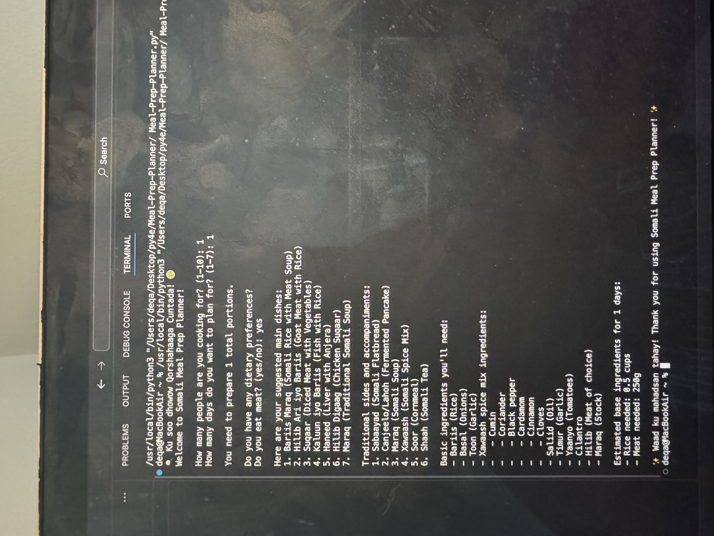

 
# Somali Meal Prep Planner 🥘

A simple and culturally thoughtful Python CLI (Command Line Interface) app that helps users plan traditional Somali meals for multiple people over multiple days. This tool includes meat and vegetarian meal options, traditional sides, a basic shopping list, and calculated ingredient estimates.

---

## ✨ Highlights

✅ User-friendly CLI design  
✅ Cultural consideration and internationalization  
✅ Clean, well-structured Python code  
✅ Real-world value (meal planning + portions)  
✅ No external libraries required – 100% Python 3  

---

## 📸 Demo Preview

Coming soon — or run it locally using the steps below!

---

## 🛠️ How to Run This App

1. Make sure you have **Python 3** installed:
   ```bash
   python --version


Run the program:

python meal_prep_planner.py

You’ll be prompted to enter:

      Number of people you’re cooking for
   
       Number of days to plan
   
     Dietary preference (meat or vegetarian)
  

The app will then suggest meals, display sides, list ingredients, and estimate quantities.


## 🧠 Code Overview

- **`welcome()`**: Displays a friendly greeting in Somali and English to introduce the user to the Somali Meal Prep Planner.

### 📸 Screenshots

#### Welcome Screen





This screenshot displays the full interaction with the Somali Meal Prep Planner:

1. 🧑 **How many people are you cooking for?** — User chooses between 1–10.  
2. 📅 **How many days do you want to plan for?** — User chooses between 1–7.  
3. 🥩 **Do you eat meat?** — User responds `yes` or `no`.

👉 Based on your answers, the program:
- Recommends a list of **Somali main dishes** 🍛
- Includes **traditional sides and accompaniments** 🫓
- Generates a **shopping list** with estimated ingredient quantities 🛒

It ends with a warm thank-you:
> ✨ **Waad ku mahadsan tahay!** Thank you for using Somali Meal Prep Planner! ✨

---

### 🚀 Final Thoughts

Thank you for taking the time to explore the **Somali Meal Prep Planner**! I hope this project provides both practical and culturally relevant solutions for meal planning. If you have any suggestions, improvements, or feedback, feel free to contribute or reach out!

Happy cooking! 🍳  
**Deqa** 🙏

---

💬 **Got Questions?**  
Feel free to open an issue or send a pull request to make improvements.

---

### 📬 Get in Touch

- **LinkedIn:** [Deqa Mohamed](https://www.linkedin.com/in/deqa-mohamed-13149a23b/)
- **Email:** [deqoahmed122@gmail.com](mailto:deqoahmed122@gmail.com)


---


