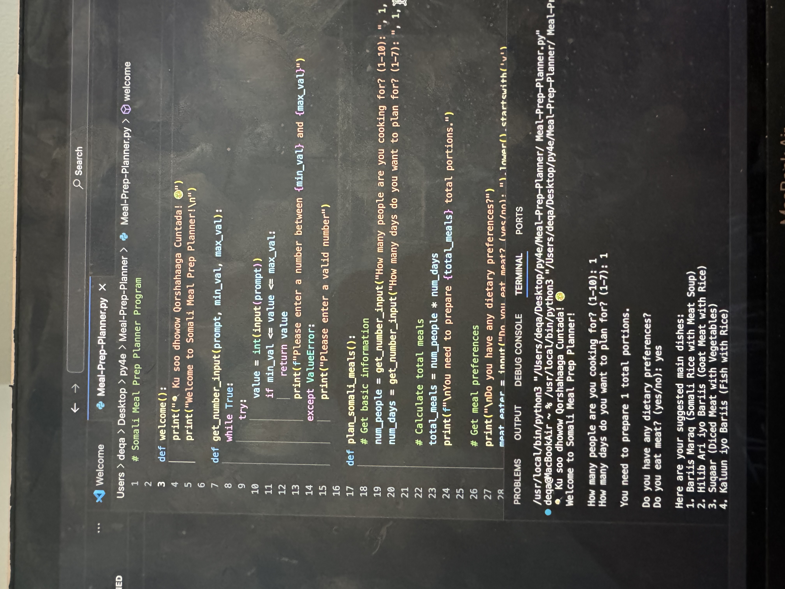

 
# 🇸🇴 Somali Meal Prep Planner 🥘

A simple and culturally thoughtful Python CLI (Command Line Interface) app that helps users plan traditional Somali meals for multiple people over multiple days. This tool includes meat and vegetarian meal options, traditional sides, a basic shopping list, and calculated ingredient estimates.

---

## ✨ Highlights

✅ User-friendly CLI design  
✅ Cultural consideration and internationalization  
✅ Clean, well-structured Python code  
✅ Real-world value (meal planning + portions)  
✅ No external libraries required – 100% Python 3  

---

## 📸 Demo Preview

Coming soon — or run it locally using the steps below!

---

## 🛠️ How to Run This App

1. Make sure you have **Python 3** installed:
   ```bash
   python --version


Clone this repository:
git clone https://github.com/YOUR_USERNAME/somali-meal-prep-planner.git
cd somali-meal-prep-planner

Run the program:

python meal_prep_planner.py

You’ll be prompted to enter:

      Number of people you’re cooking for
   
       Number of days to plan
   
     Dietary preference (meat or vegetarian)
  

The app will then suggest meals, display sides, list ingredients, and estimate quantities.


## 🧠 Code Overview

- **`welcome()`**: Displays a friendly greeting in Somali and English to introduce the user to the Somali Meal Prep Planner.

### 📸 Screenshots

#### Welcome Screen


When the program is run, it first greets the user in both Somali and English, making it culturally engaging. The user is then prompted to enter basic information such as:
1. How many people they are cooking for (e.g., 1).
2. How many days they want to plan for (e.g., 1).
3. Their dietary preferences, specifically whether they eat meat (e.g., yes).

Based on the user input, the program suggests appropriate Somali dishes and ingredients to prepare.


get_number_input(prompt, min_val, max_val)
Safely receives user input for a number between specified values. Repeats until valid.

plan_somali_meals()
Handles the entire planning logic:

Collects user inputs

Displays culturally authentic meal options based on dietary preference

Suggests Somali sides

Builds a basic ingredient shopping list

Calculates rice and meat quantities

main()
Runs the welcome() and plan_somali_meals() functions. Ends with a thank-you message.


